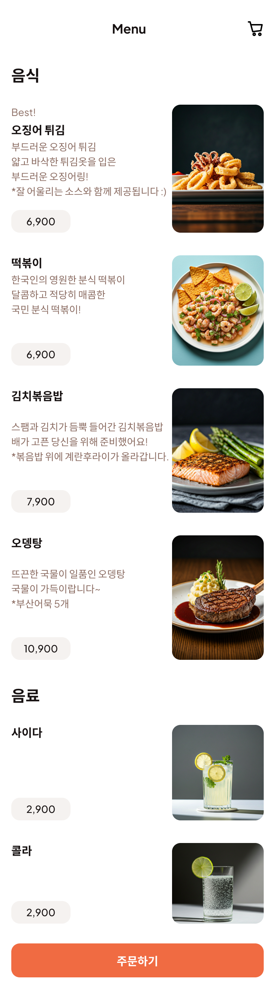
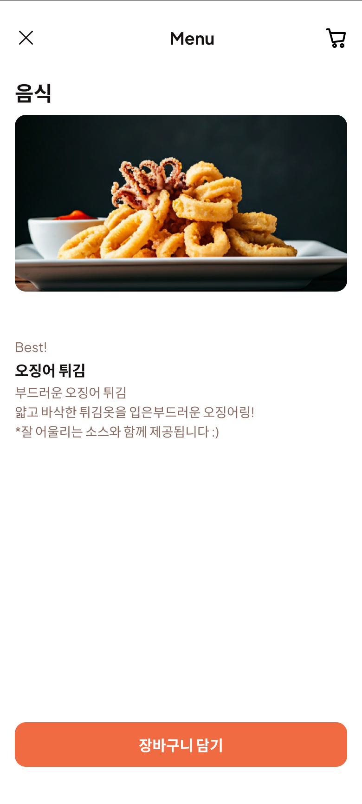
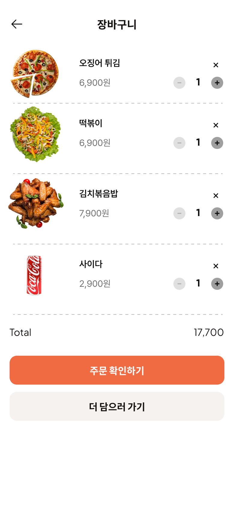
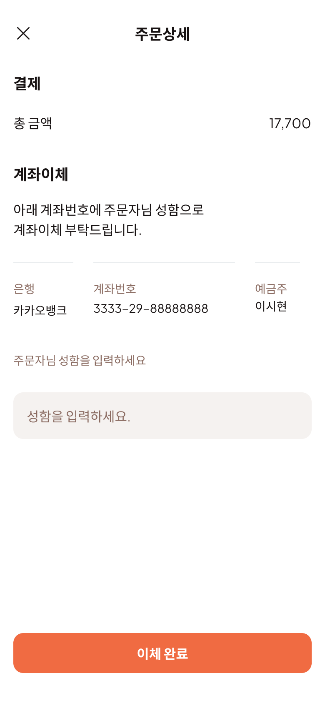
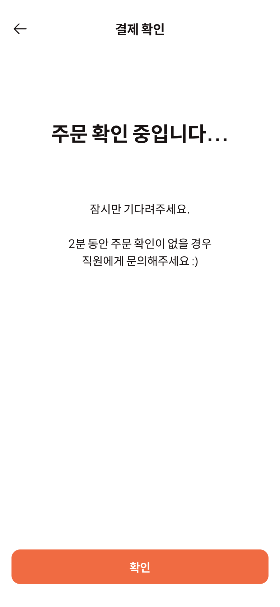
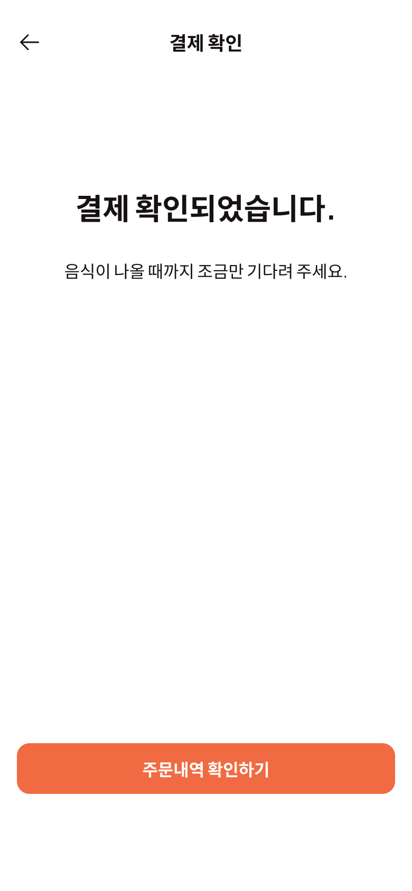

# UI 기능 명세

구매자 페이지와 관리자 페이지를 별도로 나누어서 설계하였습니다.

# 구매자 UI 기능 명세

## 1. 전체 메뉴 페이지

### 1.1 화면 이름

Menu Page

### 1.2 기능

| 기능                      | 사용자 행동                                  | 조건 / 예외                   | 처리 로직                                                                                                                            | 결과                            |
| ------------------------- | -------------------------------------------- | ----------------------------- | ------------------------------------------------------------------------------------------------------------------------------------ | ------------------------------- |
| 메뉴 목록 조회            | 페이지 진입                                  | 없음                          | 1. 서버에서 메뉴 목록 API 호출 (`GET /api/menu`) 2. 응답 데이터를 상태에 저장 3. UI에 카테고리별(음식, 음료)로 분류하여 렌더링 | 음식·음료 메뉴 카드 리스트 표시 |
| 음식 상세 정보            | 메뉴 카드 클릭                               | 품절 상태가 아님              | 선택한 메뉴의 세부 정보 팝업창 띄우기 & 배경 회색                                                                                    | 음식 팝업창 & 배경 회색         |
| 주문하기 or 장바구니 버튼 | 하단 "주문하기" or 장바구니 아이콘 버튼 클릭 | 장바구니에 최소 1개 이상 담김 | 장바구니 페이지로 라우팅(`/order`)                                                                                                   | 장바구니 페이지로 이동          |
| 주문 불가 안내            | 하단 "주문하기" 버튼 클릭                    | 장바구니 비어 있음            | 토스트 메시지 표시("주문할 메뉴를 선택해주세요.")                                                                                    | 현재 페이지 유지                |

## 2. 음식 팝업창

### 1.1 화면 이름

음식 상세 정보 팝업

### 1.2 기능

| 기능             | 사용자 행동                         | 조건 / 예외    | 처리 로직                                                                                     | 결과                                    |
| ---------------- | ----------------------------------- | -------------- | --------------------------------------------------------------------------------------------- | --------------------------------------- |
| 메뉴 정보 표시   | 팝업 진입 시                        | 메뉴 ID 유효   | 1. API 호출(`GET /api/menu/:id`)로 메뉴 상세 정보 가져오기 2. 이미지·이름·설명·가격 렌더링 | 화면에 해당 메뉴의 상세정보 표시        |
| 팝업 닫기        | 상단 좌측 닫기(X) or 팝업 외부 클릭 | 없음           | 팝업 닫기 이벤트 실행                                                                         | 이전 페이지(메뉴 목록)로 복귀           |
| 장바구니 담기    | 하단 "장바구니 담기" 버튼 클릭      | 품절 상태 아님 | 1. 선택 메뉴를 장바구니 상태에 추가 (이미 존재 시 수량 +1) 2. 장바구니 상태 전역 저장   | 장바구니 아이콘에 수량 반영 & 팝업 닫힘 |
| 데이터 로드 실패 | 팝업 진입 시                        | API 호출 실패  | 오류 메시지 표시 & 닫기 버튼 노출                                                             | 이전 화면 유지                          |

## 3. 장바구니

### 3.1 화면 이름

장바구니

### 3.2 기능

| 기능                   | 사용자 행동                     | 조건 / 예외            | 처리 로직                                                          | 결과                           |
| ---------------------- | ------------------------------- | ---------------------- | ------------------------------------------------------------------ | ------------------------------ |
| 이전 페이지로 이동     | 상단 좌측 화살표 클릭           | 없음                   | 이전 페이지로 라우팅                                               | 이전 화면으로 이동             |
| 수량 감소              | 메뉴 행의 `-` 버튼 클릭         | 현재 수량 > 1          | 해당 메뉴의 수량 -1 총액(Total) 재계산                          | 수량 변경 및 총액 갱신         |
| 수량 증가              | 메뉴 행의 `+` 버튼 클릭         | 재고 초과 불가         | 해당 메뉴의 수량 +1 총액(Total) 재계산                          | 수량 변경 및 총액 갱신         |
| 메뉴 삭제              | 메뉴 행의 `×` 버튼 클릭         | 없음                   | 해당 메뉴를 장바구니 상태에서 제거 총액(Total) 재계산           | 해당 메뉴 행 삭제 및 총액 갱신 |
| 총액 표시              | 장바구니 데이터 변경 시         | 없음                   | 모든 메뉴의 (가격 × 수량) 합산                                     | 화면 하단 Total 영역에 표시    |
| 주문 확인              | 하단 "주문 확인하기" 버튼 클릭  | 장바구니 비어있지 않음 | 주문 확인 페이지로 라우팅(`/order/confirm`)                        | 주문 확인 페이지 이동          |
| 더 담으러 가기         | 하단 "더 담으러 가기" 버튼 클릭 | 없음                   | 메뉴 목록 페이지로 라우팅(`/menu`)                                 | 메뉴 목록 페이지 이동          |
| 장바구니 비어있음 표시 | 장바구니 수량 = 0               | 없음                   | "장바구니가 비어있습니다" 메시지 표시 & 메뉴 담기 유도 버튼 활성화 | 빈 장바구니 UI 표시            |

## 4. 주문 상세

| 기능                | 사용자 행동                 | 조건 / 예외                 | 처리 로직                                                                                                                           | 결과                                               |
| ------------------- | --------------------------- | --------------------------- | ----------------------------------------------------------------------------------------------------------------------------------- | -------------------------------------------------- |
| 페이지 닫기         | 상단 좌측 닫기(X) 버튼 클릭 | 없음                        | 팝업/페이지 닫기 이벤트 실행                                                                                                        | 이전 화면(장바구니 또는 주문 확인 페이지)으로 이동 |
| 총 금액 표시        | 페이지 진입                 | 주문 데이터 존재            | 주문 데이터에서 총 금액 값 가져와 화면에 표시                                                                                       | 상단 "총 금액" 영역에 표시                         |
| 계좌 정보 표시      | 페이지 진입                 | 주문 데이터 존재            | 결제용 계좌 정보(은행명, 계좌번호, 예금주) 표시                                                                                     | 사용자에게 계좌이체 정보 안내                      |
| 성함 입력           | 성함 입력란 포커스          | 없음                        | 입력값을 상태에 저장                                                                                                                | 입력된 성함이 이체 완료 처리 시 사용됨             |
| 이체 완료           | 하단 "이체 완료" 버튼 클릭  | 성함 입력값이 비어있지 않음 | 1. 입력값 유효성 검사 2. 주문 상태 API 호출(`POST /api/orders/confirm`)로 결제 확인 요청 3. 성공 시 결제 확인중 페이지로 이동 | 결제 확인 중 페이지로 라우팅                       |
| 입력값 누락 시 경고 | 하단 "이체 완료" 버튼 클릭  | 성함 입력란 비어 있음       | 경고 메시지 표시("성함을 입력해주세요.")                                                                                            | 현재 페이지 유지                                   |

## 5. 결제 승인 대기

### 5.1 페이지 이름

결제 확인(대기) 페이지

### 5.2 기능

| 기능           | 사용자 행동          | 조건 / 예외              | 처리 로직                                                                                | 결과                         |
| -------------- | -------------------- | ------------------------ | ---------------------------------------------------------------------------------------- | ---------------------------- |
| 이전으로       | 좌상단 ← 아이콘 클릭 | 없음                     | 히스토리 뒤로 가기                                                                       | 이전 화면으로 이동           |
| 상태 대기 시작 | 페이지 진입          | `orderId` 존재           | 1) 상태 리스너 시작(SSE/WebSocket) **혹은** 폴링 시작(3\~5초 간격)  2) 로딩 문구 표시 | “주문 확인 중입니다…” 표시   |
| 자동 완료 이동 | (사용자 행동 없음)   | 서버에서 `APPROVED` 수신 | `/order/complete/:orderId` 로 라우팅                                                     | 결제 확인 완료 페이지로 이동 |
| 확인 버튼      | 하단 “확인” 클릭     | 없음                     | 홈(/menu)로 라우팅                                                                       | 메인(메뉴)로 이동            |
| 리소스 정리    | 페이지 이탈          | 없음                     | SSE/WS 연결 해제, 폴링 타이머 해제                                                       | 누수 방지                    |

### 5.3 추가 고려사항

만약에 네트워크 장애가 생겨서 요청이 안가는 문제가 있을 수 있다.

## 6. 주문 완료

### 6.1 페이지 이름

주문 완료 페이지

### 6.2 기능
| 기능          | 사용자 행동       | 조건 / 예외            | 처리 로직                    | 결과                       |
| ----------- | ------------ | ------------------ | ------------------------ | ------------------------ |
| 이전으로        | 좌상단 ← 아이콘 클릭 | 없음                 | 히스토리 뒤로 가기               | 이전 화면(결제 확인 대기 페이지)으로 이동 |
| 주문내역 확인하기   | 하단 버튼 클릭     | 없음                 | `/orders/:orderId` 로 라우팅 | 주문 상세/내역 페이지 이동          |

## 7. 주문 내역
