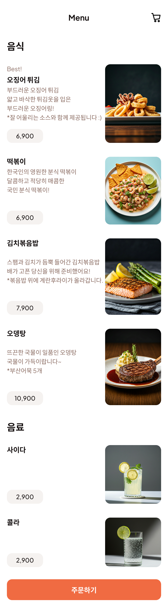

# UI 기능 명세

구매자 페이지와 관리자 페이지를 별도로 나누어서 설계하였습니다.

# 구매자 UI 기능 명세

## 1. 전체 메뉴 페이지

### 1.1 화면 이름

Menu Page

### 1.2 기능

| 기능                      | 사용자 행동                                  | 조건 / 예외                   | 처리 로직                                                                                                                            | 결과                            |
| ------------------------- | -------------------------------------------- | ----------------------------- | ------------------------------------------------------------------------------------------------------------------------------------ | ------------------------------- |
| 메뉴 목록 조회            | 페이지 진입                                  | 없음                          | 1. 서버에서 메뉴 목록 API 호출 (`GET /api/menu`) 2. 응답 데이터를 상태에 저장 3. UI에 카테고리별(음식, 음료)로 분류하여 렌더링 | 음식·음료 메뉴 카드 리스트 표시 |
| 음식 상세 정보            | 메뉴 카드 클릭                               | 품절 상태가 아님              | 선택한 메뉴의 세부 정보 팝업창 띄우기                                                                                                | 음식 팝업창                     |
| 주문하기 or 장바구니 버튼 | 하단 "주문하기" or 장바구니 아이콘 버튼 클릭 | 장바구니에 최소 1개 이상 담김 | 장바구니 페이지로 라우팅(`/order`)                                                                                                   | 장바구니 페이지로 이동          |
| 주문 불가 안내            | 하단 "주문하기" 버튼 클릭                    | 장바구니 비어 있음            | 토스트 메시지 표시("주문할 메뉴를 선택해주세요.")                                                                                    | 현재 페이지 유지                |

## 2. 음식 팝업창

### 1.1 화면 이름

음식 상세 정보 팝업

### 1.2 기능

| 기능             | 사용자 행동                    | 조건 / 예외    | 처리 로직                                                                                     | 결과                                    |
| ---------------- | ------------------------------ | -------------- | --------------------------------------------------------------------------------------------- | --------------------------------------- |
| 팝업 닫기        | 상단 좌측 닫기(X) 버튼 클릭    | 없음           | 팝업 닫기 이벤트 실행                                                                         | 이전 페이지(메뉴 목록)로 복귀           |
| 장바구니 담기    | 하단 "장바구니 담기" 버튼 클릭 | 품절 상태 아님 | 1. 선택 메뉴를 장바구니 상태에 추가 (이미 존재 시 수량 +1) 2. 장바구니 상태 전역 저장   | 장바구니 아이콘에 수량 반영 & 팝업 닫힘 |
| 장바구니 확인    | 상단 우측 장바구니 아이콘 클릭 | 없음           | 장바구니 페이지로 라우팅(`/cart`)                                                             | 장바구니 페이지 이동                    |
| 메뉴 정보 표시   | 팝업 진입 시                   | 메뉴 ID 유효   | 1. API 호출(`GET /api/menu/:id`)로 메뉴 상세 정보 가져오기 2. 이미지·이름·설명·가격 렌더링 | 화면에 해당 메뉴의 상세정보 표시        |
| 데이터 로드 실패 | 팝업 진입 시                   | API 호출 실패  | 오류 메시지 표시 & 닫기 버튼 노출                                                             | 이전 화면 유지                          |
